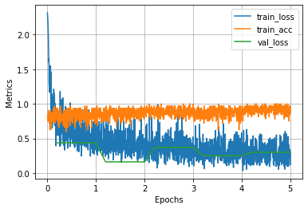

## torch utilities for recording metrics and plotting
```python
n_epochs = 5
log = Report(n_epochs)

for epoch in range(n_epochs):
    train_epoch_losses, train_epoch_accuracies = [], []
    N = len(trn_dl)
    for ix, batch in enumerate(iter(trn_dl)):
        ...
        pos = (epoch + (ix+1)/N) # a float between 0 - n_epochs
        # give any number of kwargs that need to be reported and stored.
        # args should be float
        log.record(pos=pos, train_acc=np.mean(is_correct), train_loss=batch_loss, end='\r') # impersistent log

    N = len(val_dl)
    for ix, batch in enumerate(iter(val_dl)):
        ...
        pos = (epoch + (ix+1)/N) # a float between 0 - n_epochs
        log.record(pos=pos, val_loss=batch_loss, end='\r') # impersistent log
    log.report_avgs(epoch+1) # persist the report

```


```python
log.plot() # plot everything that has been recorded
```
