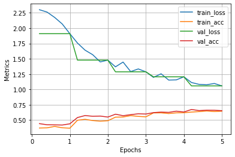

# Pytorch utilities for simple pytorch needs

## Logging and plotting metrics
```python
from torch_snippets import Report

n_epochs = 5
log = Report(n_epochs)

for epoch in range(n_epochs):
    # No need to --> train_epoch_losses, train_epoch_accuracies = [], []
    N = len(trn_dl)
    for ix, batch in enumerate(iter(trn_dl)):
        ...
        pos = (epoch + (ix+1)/N) # a float between 0 - n_epochs
        # give any number of kwargs that need to be reported and stored.
        # args should be float
        log.record(pos=pos, train_acc=np.mean(is_correct), train_loss=batch_loss, end='\r') # impersistent log

    N = len(val_dl)
    for ix, batch in enumerate(iter(val_dl)):
        ...
        pos = (epoch + (ix+1)/N) # a float between 0 - n_epochs
        log.record(pos=pos, val_loss=batch_loss, end='\r') # impersistent log
    log.report_avgs(epoch+1) # persist the report

```

* Auto calculates time remaining
* No need to preinitialize empty lists
* Automatically stores metrics as collection of key words
* Persistent vs Transient logging (use `end='\r'`)  
```python
>>> print(log.logged) # get logged metric names
# ['train_loss', 'train_acc', 'val_loss', 'val_acc']
>>> log.plot() # plot all the logged metrics
```


* Auto calculates average of all metrics in an epoch
* Plot entire training history with one command  



* selectively plot logged metrics using regex
```python
>>> log.plot('*_loss')
# or you can list out the metrics that need plotting
# >>> log.plot(['train_acc','val_acc'])
```


## Auxiliary Functions
There are simple functions that are overloaded to take inputs and perform repetitive tasks that usually take a few lines to write
#### Images
`show`, `inspect`, `Glob`, `read`
#### FilePaths
`stem`, `Glob`, `parent`, `name`
#### Dump and load python objects
`loaddill`,`dumpdill`
#### Misc 
`Tqdm`, `Timer`, `randint`, `unique`, `diff`
#### Pytorch Modules
`Reshape` and `Permute` (`nn.Modules`)


and many more... 
 
## Install
`pip install torch_snippets`

## Usage
```python
import pytorch_snippets
dir(pytorch_snippets)
```
